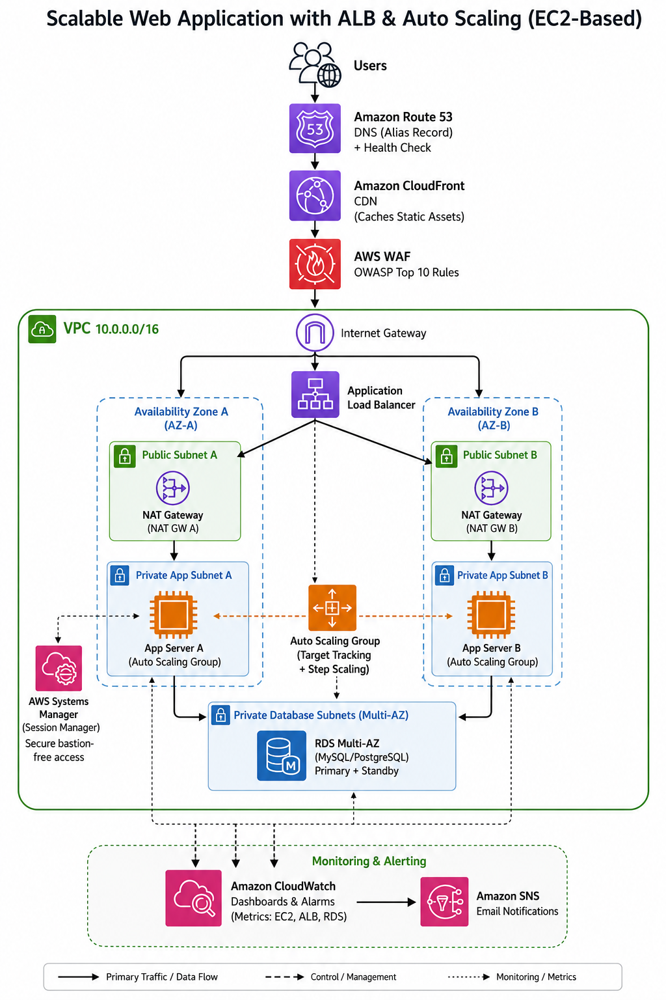

# Scalable Web Application with ALB & Auto Scaling (EC2-Based)

A production-grade, highly available web application architecture on AWS, built with EC2 instances behind an Application Load Balancer, protected by AWS WAF, accelerated by CloudFront, and backed by a Multi-AZ RDS database — all defined as reusable Terraform modules.



---

## Table of Contents

- [Overview](#overview)
- [Architecture](#architecture)
- [AWS Services Used](#aws-services-used)
- [Repository Structure](#repository-structure)
- [Prerequisites](#prerequisites)
- [Deployment Guide](#deployment-guide)
- [Post-Deployment Verification](#post-deployment-verification)
- [Accessing Instances (No Bastion, No SSH Keys)](#accessing-instances-no-bastion-no-ssh-keys)
- [Auto Scaling Behavior](#auto-scaling-behavior)
- [Security Design](#security-design)
- [Monitoring & Alerting](#monitoring--alerting)
- [Cost Considerations](#cost-considerations)
- [Cleanup / Destroy](#cleanup--destroy)
- [Learning Outcomes](#learning-outcomes)
- [Possible Extensions](#possible-extensions)

---

## Overview

This project deploys a scalable, fault-tolerant 3-tier web application on AWS:

- **Presentation / Edge**: Route 53 → CloudFront → AWS WAF → Application Load Balancer
- **Application tier**: EC2 instances in an Auto Scaling Group, running in **private subnets** across **two Availability Zones**
- **Data tier**: Amazon RDS (MySQL or PostgreSQL) in **Multi-AZ** mode for automatic failover

There is no public IP anywhere on the compute or database tiers. Instance access for troubleshooting is done exclusively through **AWS Systems Manager Session Manager** — no bastion host, no open SSH ports, no distributed SSH keys.

The entire infrastructure is defined as code using **Terraform**, organized into independent, reusable modules (VPC, Security, ALB, ASG, RDS, CloudFront, Route 53, Monitoring).

## Architecture


**Traffic flow:**

1. A user requests `https://www.yourdomain.com`
2. **Route 53** resolves the alias record (with a health check on the ALB)
3. **CloudFront** serves cached static assets from edge locations, and forwards dynamic requests to the origin
4. **AWS WAF** inspects every request against managed rule groups (SQLi, XSS, known bad inputs, IP reputation, rate limiting) before it reaches the load balancer
5. The **Application Load Balancer** (in public subnets) terminates TLS and routes Layer-7 traffic to healthy targets
6. The **Auto Scaling Group** maintains EC2 instances across two private subnets (one per AZ); ALB health checks drive instance replacement
7. Application instances connect to the **RDS Multi-AZ** database over a private route — the DB is never reachable from the internet
8. **CloudWatch** collects metrics/logs from every tier; alarms notify an **SNS** topic (email) on anomalies
9. Operators access instances through **SSM Session Manager**, with no inbound SSH required

## AWS Services Used

| Service | Purpose |
|---|---|
| **VPC** | Public + private subnets across 2 AZs, route tables, NAT Gateways, Security Groups, NACLs |
| **EC2 + Auto Scaling Group** | Application compute, launch template, target tracking + step scaling policies |
| **Application Load Balancer + WAF** | Layer-7 routing, health checks, OWASP Top 10 protection via AWS Managed Rules |
| **CloudFront** | Edge caching for static assets, reduced global latency |
| **RDS Multi-AZ** | MySQL/PostgreSQL with synchronous standby and automated failover |
| **Route 53** | DNS alias record to CloudFront/ALB, health checks |
| **Systems Manager (Session Manager)** | Secure, bastion-free, SSH-key-free instance access |
| **CloudWatch + SNS** | Dashboards, metric alarms, and email notifications |

## Repository Structure

```
.
├── README.md
├── docs/
│   └── architecture-diagram.png
└── terraform/
    ├── main.tf                    # Wires all modules together
    ├── variables.tf               # Root input variables
    ├── outputs.tf                 # Root outputs (ALB DNS, CloudFront domain, etc.)
    ├── versions.tf                # Provider + Terraform version constraints
    ├── terraform.tfvars.example   # Copy to terraform.tfvars and fill in
    └── modules/
        ├── vpc/                   # Subnets, route tables, NAT GWs, NACLs
        ├── security/              # Security groups (ALB, app, db, vpc endpoints)
        ├── alb/                   # ALB, target group, listeners, WAF WebACL
        ├── asg/                   # Launch template, ASG, scaling policies, IAM role
        ├── rds/                   # RDS Multi-AZ instance + subnet/parameter groups
        ├── cloudfront/            # CloudFront distribution in front of the ALB
        ├── route53/               # Hosted zone, alias record, health check
        └── monitoring/            # CloudWatch alarms, dashboard, SNS topic
```

## Prerequisites

- An AWS account with sufficient permissions (VPC, EC2, ELB, RDS, WAF, CloudFront, Route 53, IAM, CloudWatch, SNS)
- [Terraform](https://developer.hashicorp.com/terraform/downloads) >= 1.5.0
- [AWS CLI](https://docs.aws.amazon.com/cli/latest/userguide/getting-started-install.html) configured with credentials (`aws configure`)
- (Optional but recommended) A registered domain and an **ACM certificate** in the ALB's region for HTTPS, plus a second ACM certificate in `us-east-1` if you want a custom domain on CloudFront
- (Optional) An existing Route 53 hosted zone, or let Terraform create one

## Deployment Guide

```bash
git clone <your-repo-url>
cd <repo-name>/terraform

# 1. Copy the example variables file and fill in real values
cp terraform.tfvars.example terraform.tfvars
# Edit terraform.tfvars: set db_password, domain_name, alert_email, acm_certificate_arn, etc.

# 2. Initialize Terraform (downloads the AWS provider)
terraform init

# 3. Review the execution plan
terraform plan

# 4. Apply
terraform apply
```

Terraform will provision, in order: the VPC and subnets, security groups, the ALB + WAF, the launch template + ASG, the RDS Multi-AZ instance, the CloudFront distribution, the Route 53 record (if a domain is provided), and the CloudWatch/SNS monitoring stack.

A typical first deployment takes **15–20 minutes**, mostly waiting on the RDS Multi-AZ instance to become available.

> **Never commit `terraform.tfvars`** — it contains the database password. It's already excluded via `.gitignore`. For real production use, pull the DB password from **AWS Secrets Manager** or **SSM Parameter Store** instead of a plain variable.

## Post-Deployment Verification

```bash
terraform output alb_dns_name
terraform output cloudfront_domain_name
```

- Open the CloudFront domain (or your custom domain) in a browser — you should see the sample HTML page served from a healthy EC2 instance.
- Check target health: **EC2 Console → Target Groups → your target group → Targets tab** — all targets should show `healthy`.
- Trigger a scaling event by stressing CPU on an instance (via Session Manager, see below) and watch the ASG **Activity History** add instances.

## Accessing Instances (No Bastion, No SSH Keys)

Instances have no public IP and no open SSH port. Access is via SSM Session Manager:

```bash
aws ssm start-session --target <instance-id>
```

This works because the launch template attaches an IAM instance profile with `AmazonSSMManagedInstanceCore`, and the SSM Agent (pre-installed on Amazon Linux 2023) registers the instance automatically as long as it has outbound HTTPS access (via the NAT Gateway, or private VPC interface endpoints for `ssm`, `ssmmessages`, and `ec2messages` if you want a fully NAT-free setup).

## Auto Scaling Behavior

Two complementary scaling policies are configured on the ASG:

- **Target Tracking (CPU)** — keeps average CPU utilization at `var.target_cpu_utilization` (default `60%`) by adding/removing instances automatically.
- **Step Scaling (Request Count)** — a CloudWatch alarm on `RequestCountPerTarget` triggers a step-scaling policy that adds 2 instances if the metric is moderately over threshold, or 4 instances if it spikes further — for faster reaction to sudden traffic surges than CPU-based scaling alone would allow.

`min_size` / `max_size` / `desired_capacity` are all configurable via variables, and instances are spread evenly across both private application subnets (both AZs) by the ASG's `vpc_zone_identifier`.

## Security Design

- **Network isolation**: EC2 instances and RDS live exclusively in private subnets; only the ALB sits in public subnets.
- **Security Groups** are chained: internet → ALB SG (80/443) → App SG (80, only from ALB SG) → DB SG (3306/5432, only from App SG).
- **NACLs** provide a second layer of defense per subnet tier.
- **AWS WAF** on the ALB uses AWS Managed Rule Groups covering the OWASP Top 10 (Common Rule Set, Known Bad Inputs, SQLi Rule Set) plus an IP reputation list and a rate-based rule to blunt volumetric abuse.
- **IMDSv2 is enforced** on all instances (`http_tokens = "required"`) to mitigate SSRF-based credential theft.
- **EBS volumes and RDS storage are encrypted** at rest.
- **No SSH keys or bastion hosts** — all administrative access goes through IAM-authenticated, fully logged SSM Session Manager sessions.

## Monitoring & Alerting

A CloudWatch dashboard visualizes:
- ASG average CPU utilization and in-service instance count
- ALB request count, target 5XX errors, and target response time
- RDS CPU utilization and free storage space

CloudWatch Alarms notify an SNS topic (optionally emailing `var.alert_email`) on:
- High ASG CPU (>80%)
- Elevated ALB 5XX error rate
- Any unhealthy ALB target
- High RDS CPU (>80%)
- Low RDS free storage (<2 GB)

## Cost Considerations

This architecture is **not free-tier-only** — Multi-AZ RDS, NAT Gateways (one per AZ), and CloudFront all incur ongoing charges. Approximate monthly cost drivers (region/usage dependent):

- 2× NAT Gateway (hourly + data processing)
- RDS Multi-AZ instance (roughly 2x a single-AZ instance of the same class)
- ALB (hourly + LCU usage)
- CloudFront (pay-per-use, generally inexpensive at low traffic)
- EC2 instances per the ASG's desired capacity

For a learning/demo environment, consider: a single NAT Gateway (edit the VPC module), `db.t3.micro`/`db.t4g.micro`, and `asg_min_size = 1` — then scale up for a "production-grade" demonstration.

## Cleanup / Destroy

```bash
cd terraform
terraform destroy
```

RDS `deletion_protection` defaults to `true` — set it to `false` in `terraform.tfvars` (via a custom override, or temporarily edit the module call) before destroying, or the destroy will fail on the DB instance.

## Learning Outcomes

By working through this project, you will practice:

- Designing a VPC with correct subnet tiers, route tables, and per-AZ NAT Gateway configuration
- Building highly available architectures that span multiple Availability Zones
- Configuring ALB listener rules, target groups, and health checks
- Implementing Auto Scaling with both target tracking and step scaling policies
- Securing applications with WAF managed rule groups, layered Security Groups, and private subnets
- Using Systems Manager Session Manager as a secure, bastion-free access pattern
- Structuring a non-trivial AWS deployment as reusable Terraform modules

## Possible Extensions

- Add an S3 + CloudFront origin for truly static assets (images, JS, CSS) separate from the dynamic ALB origin
- Add a CI/CD pipeline (CodePipeline/CodeBuild or GitHub Actions) that runs `terraform plan`/`apply` on merge
- Move the DB password to AWS Secrets Manager with automatic rotation
- Add a `CLOUDFRONT`-scope WAF WebACL (separate from the ALB's `REGIONAL` one) for edge-level protection
- Blue/green or canary deployments using weighted ALB target groups
- Multi-region active-passive DR with Route 53 failover routing

---

## License

This project is provided as an educational reference architecture. Adapt it to your own security, compliance, and cost requirements before using it in production.
